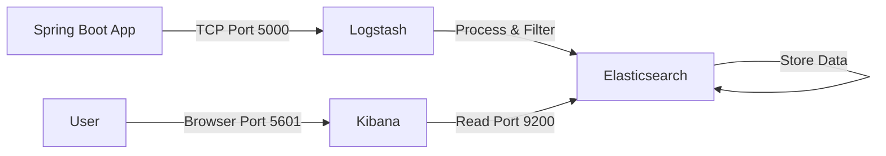

Here is a comprehensive, reorganized, and beginner-friendly guide. I have structured this as a **`README.md`** file. It follows a "Big Steps" (Architecture/Concepts) and "Small Steps" (Implementation) approach, ensuring you understand *what* you are building while giving you copy-paste ready code.

***

# 🚀 Ultimate Beginner's Guide to ELK Stack with Spring Boot

This guide provides a production-ready, best-practice approach to monitoring a Spring Boot application using the Elastic Stack (Elasticsearch, Logstash, Kibana) running on Docker.

---

## 📚 Table of Contents
1.  **The Big Picture** (Architecture & Concepts)
2.  **Project Structure**
3.  **Step 1: Docker Infrastructure** (The Server Side)
4.  **Step 2: Spring Boot Configuration** (The Application Side)
5.  **Step 3: Running & Verification**
6.  **Step 4: Using Kibana**
7.  **Troubleshooting & Cheatsheet**

---

## 1. 🌍 The Big Picture (Architecture)

Before writing code, understand how data flows. We are building a pipeline where your application pushes structured logs to a visualization dashboard.



*   **Spring Boot:** Generates logs in JSON format.
*   **Logstash (The Plumber):** Receives logs, processes them (adds timestamps, filters data), and ships them to the database.
*   **Elasticsearch (The Database):** A search engine that stores logs.
*   **Kibana (The Dashboard):** A web UI to visualize and search the logs.

---

## 2. 📁 Project Structure

Create a folder named `elk-monitoring`. Inside, create the following structure exactly as shown.

```text
elk-monitoring/
│
├── docker/                          # Infrastructure (ELK)
│   ├── docker-compose.yml           # Main orchestrator
│   │
│   ├── elasticsearch/
│   │   └── config/
│   │       └── elasticsearch.yml    # Database settings
│   │
│   ├── logstash/
│   │   ├── config/
│   │   │   └── logstash.yml        # Pipeline settings
│   │   └── pipeline/
│   │       └── logstash.conf       # The logic (Input -> Output)
│   │
│   └── kibana/
│       └── config/
│           └── kibana.yml          # Dashboard settings
│
└── spring-boot-app/                 # Application
    ├── pom.xml
    ├── src/
    │   ├── main/
    │   │   ├── resources/
    │   │   │   ├── application.yml
    │   │   │   └── logback-spring.xml  # Crucial for JSON formatting
    │   │   └── java/.../DemoApplication.java
```

---

## 3. 🐳 Step 1: Docker Infrastructure

This section sets up the servers. We use Docker Compose to spin up all three ELK services at once.

### A. The `docker-compose.yml`
*Location: `docker/docker-compose.yml`*

This file uses **Healthchecks** (Best Practice) to ensure services start in the correct order (ES -> Logstash -> Kibana).

```yaml
version: '3.8'

services:
  # 1. ELASTICSEARCH - The Database
  elasticsearch:
    image: docker.elastic.co/elasticsearch/elasticsearch:8.11.1
    container_name: elasticsearch
    environment:
      - node.name=elasticsearch
      - cluster.name=es-docker-cluster
      - discovery.type=single-node
      - bootstrap.memory_lock=true
      - "ES_JAVA_OPTS=-Xms512m -Xmx512m"  # Limit memory usage
      - xpack.security.enabled=false      # Disabled for beginner simplicity
    ulimits:
      memlock:
        soft: -1
        hard: -1
    volumes:
      - elasticsearch-data:/usr/share/elasticsearch/data
      - ./elasticsearch/config/elasticsearch.yml:/usr/share/elasticsearch/config/elasticsearch.yml:ro
    ports:
      - "9200:9200"
    networks:
      - elk
    healthcheck:
      test: ["CMD-SHELL", "curl -s http://localhost:9200 >/dev/null || exit 1"]
      interval: 30s
      timeout: 10s
      retries: 5

  # 2. LOGSTASH - The Pipeline
  logstash:
    image: docker.elastic.co/logstash/logstash:8.11.1
    container_name: logstash
    environment:
      - LS_JAVA_OPTS=-Xmx256m -Xms256m
    volumes:
      - ./logstash/config/logstash.yml:/usr/share/logstash/config/logstash.yml:ro
      - ./logstash/pipeline:/usr/share/logstash/pipeline:ro
    ports:
      - "5000:5000"       # TCP port for Spring Boot
      - "5000:5000/udp"
      - "9600:9600"
    networks:
      - elk
    depends_on:
      elasticsearch:
        condition: service_healthy

  # 3. KIBANA - The Dashboard
  kibana:
    image: docker.elastic.co/kibana/kibana:8.11.1
    container_name: kibana
    environment:
      - ELASTICSEARCH_HOSTS=http://elasticsearch:9200
    volumes:
      - ./kibana/config/kibana.yml:/usr/share/kibana/config/kibana.yml:ro
    ports:
      - "5601:5601"
    networks:
      - elk
    depends_on:
      elasticsearch:
        condition: service_healthy

networks:
  elk:
    driver: bridge

volumes:
  elasticsearch-data:
```

### B. Configuration Files

**1. Elasticsearch Config**
*Location: `docker/elasticsearch/config/elasticsearch.yml`*
```yaml
cluster.name: "docker-cluster"
network.host: 0.0.0.0
```

**2. Logstash Settings**
*Location: `docker/logstash/config/logstash.yml`*
```yaml
http.host: "0.0.0.0"
xpack.monitoring.elasticsearch.hosts: [ "http://elasticsearch:9200" ]
```

**3. Logstash Pipeline (CRITICAL)**
*Location: `docker/logstash/pipeline/logstash.conf`*
This tells Logstash how to handle the data. We use `json_lines` codec to read the logs sent by Spring Boot.
```conf
input {
  tcp {
    port => 5000
    codec => json_lines
  }
}

filter {
  # Add specific tags or parse dates if needed here
}

output {
  elasticsearch {
    hosts => ["elasticsearch:9200"]
    index => "springboot-logs-%{+YYYY.MM.dd}"
  }
  stdout { codec => rubydebug } # Debugging: Print logs to Docker console
}
```

**4. Kibana Config**
*Location: `docker/kibana/config/kibana.yml`*
```yaml
server.name: kibana
server.host: "0.0.0.0"
elasticsearch.hosts: [ "http://elasticsearch:9200" ]
monitoring.ui.container.elasticsearch.enabled: true
```

---

## 4. ☕ Step 2: Spring Boot Configuration

We need to tell Spring Boot to stop just printing text to the console and start sending JSON objects to Logstash.

### A. Dependencies (`pom.xml`)
We use `logstash-logback-encoder`. This library is the standard best practice for Java logging.

```xml
<dependencies>
    <!-- Standard Web Starter -->
    <dependency>
        <groupId>org.springframework.boot</groupId>
        <artifactId>spring-boot-starter-web</artifactId>
    </dependency>

    <!-- THE BRIDGE: Logback to Logstash Encoder -->
    <dependency>
        <groupId>net.logstash.logback</groupId>
        <artifactId>logstash-logback-encoder</artifactId>
        <version>7.4</version>
    </dependency>
</dependencies>
```

### B. Application Config (`application.yml`)
*Location: `src/main/resources/application.yml`*

```yaml
spring:
  application:
    name: my-super-app

server:
  port: 8080

# Define where Logstash is listening
logstash:
  host: localhost
  port: 5000
```

### C. Logging Config (`logback-spring.xml`)
*Location: `src/main/resources/logback-spring.xml`*

This is the "magic" file. It defines an `appender`. It sends logs to the console (for you) and to Logstash (for Kibana) simultaneously.

```xml
<?xml version="1.0" encoding="UTF-8"?>
<configuration>
    <include resource="org/springframework/boot/logging/logback/defaults.xml"/>
    
    <!-- Appender 1: Console (Human Readable) -->
    <appender name="CONSOLE" class="ch.qos.logback.core.ConsoleAppender">
        <encoder>
            <pattern>${CONSOLE_LOG_PATTERN}</pattern>
        </encoder>
    </appender>

    <!-- Appender 2: Logstash (JSON format via TCP) -->
    <appender name="LOGSTASH" class="net.logstash.logback.appender.LogstashTcpSocketAppender">
        <!-- Destination -->
        <destination>localhost:5000</destination>
        
        <!-- Keep connection alive -->
        <keepAliveDuration>5 minutes</keepAliveDuration>
        
        <encoder class="net.logstash.logback.encoder.LogstashEncoder">
            <!-- Add custom fields to every log -->
            <customFields>{"app_name":"my-super-app", "env":"dev"}</customFields>
        </encoder>
    </appender>

    <!-- Root Logger -->
    <root level="INFO">
        <appender-ref ref="CONSOLE" />
        <appender-ref ref="LOGSTASH" />
    </root>
</configuration>
```

### D. Java Controller (Generate Logs)
*Location: `src/main/java/.../UserController.java`*

```java
package com.example.demo.controller;

import org.slf4j.Logger; // Use SLF4J (Best Practice interface)
import org.slf4j.LoggerFactory;
import org.springframework.web.bind.annotation.GetMapping;
import org.springframework.web.bind.annotation.RestController;

@RestController
public class UserController {

    // 1. Define the logger
    private static final Logger logger = LoggerFactory.getLogger(UserController.class);

    @GetMapping("/api/hello")
    public String hello() {
        // 2. Log an info message
        logger.info("👋 Hello endpoint was called!");
        return "Hello World";
    }

    @GetMapping("/api/error")
    public String triggerError() {
        try {
            int i = 1 / 0; // Simulate crash
        } catch (Exception e) {
            // 3. Log an error with stack trace
            logger.error("🔥 Something went wrong: {}", e.getMessage(), e);
        }
        return "Check your Kibana!";
    }
}
```

---

## 5. 🏃 Step 3: Running & Verification

### 1. Start Docker (Infrastructure)
Open your terminal in the `docker` folder.

```bash
cd docker
docker-compose up -d
```
*Wait about 60 seconds.* Use `docker-compose ps` to verify all 3 services state is "Up" or "healthy".

### 2. Start Spring Boot (Application)
Open a new terminal in the `spring-boot-app` folder.

```bash
mvn spring-boot:run
```

### 3. Generate Traffic
Open your browser or Postman and hit:
*   `http://localhost:8080/api/hello` (Refresh 5 times)
*   `http://localhost:8080/api/error` (Refresh 2 times)

---

## 6. 📊 Step 4: Using Kibana

This is where the magic happens.

1.  **Open Kibana:** Go to `http://localhost:5601`.
2.  **Access Management:**
    *   Click the "Hamburger Menu" (Top Left) -> **Stack Management**.
    *   Click **Data Views** (or Index Patterns in older versions).
    *   Click **Create data view**.
3.  **Define Pattern:**
    *   Name: `springboot-logs-*` (This matches the output in `logstash.conf`).
    *   Timestamp field: Select `@timestamp`.
    *   Click **Save data view**.
4.  **View Logs:**
    *   Click Menu -> **Discover**.
    *   You will see your Java logs! You can filter by `level: ERROR` or search for "Hello".

---

## 7. 🆘 Troubleshooting & Cheatsheet

### Common Issues

1.  **Elasticsearch crashes immediately (Exit Code 137 or 78):**
    *   *Cause:* Not enough RAM or Docker limit.
    *   *Fix:* Ensure Docker Desktop has at least 4GB RAM allocated.

2.  **Logstash "Connection Refused":**
    *   *Cause:* Elasticsearch isn't fully ready yet.
    *   *Fix:* Wait. The `depends_on` in docker-compose helps, but ES takes time. Check `docker logs elasticsearch`.

3.  **No logs in Kibana:**
    *   *Check 1:* Did you create the Data View?
    *   *Check 2:* Is `logback-spring.xml` sending to `localhost:5000`?
    *   *Check 3:* Is Logstash printing logs? Run `docker logs -f logstash`. If you see JSON there, the connection is working.

### Useful Commands

```bash
# Start everything in background
docker-compose up -d

# Stop everything and remove volumes (Fresh start)
docker-compose down -v

# View logs of specific container
docker logs -f logstash
docker logs -f elasticsearch

# Check Logstash Port
telnet localhost 5000
```

### Best Practices Checklist
*   ✅ **Always use SLF4J:** `LoggerFactory.getLogger(...)`
*   ✅ **Use Asynchronous Logging:** In production, wrap the `LogstashTcpSocketAppender` in an `<appender name="ASYNC" class="ch.qos.logback.classic.AsyncAppender">` to prevent logging from slowing down your app.
*   ✅ **Structured Logging:** Don't just log strings (`"User logged in"`). Log data (`"User logged in", key=value`).
*   ✅ **Security:** This guide disables security (`xpack.security.enabled=false`) for ease of learning. In production, enable this and set up passwords.


```Url
https://freedium-mirror.cfd/https://medium.com/@ankitmahala07/complete-beginners-guide-setup-elk-stack-elasticsearch-logstash-kibana-spring-boot-27d988a156dc
```
